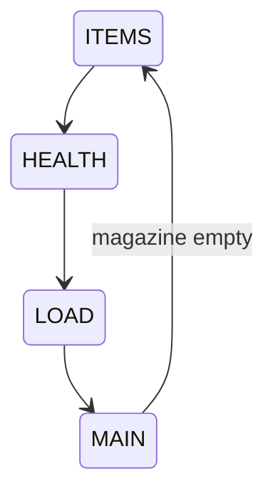

# Galactic Reserve Games

This project contains several mini games implemented for the Galactic Reserve site.
The **Buckshot Roulette** directory includes a simple Node based implementation
used in the repository tests.

There is also a placeholder HTML page under `pages/buckshot.html` that shows
the planned layout for the game.

## Running the tests

```
npm test
```

## Buckshot Roulette CLI

A minimal text interface is provided to play Buckshot Roulette against a basic
AI.

```
node buckshot-cli.js
```

During the game the CLI prints current HP, remaining shell counts and your
inventory. Commands allow you to `shoot`, `use <index>` to apply an item,
`save <file>` or `load <file>` and `quit`.

## Game State Flow


